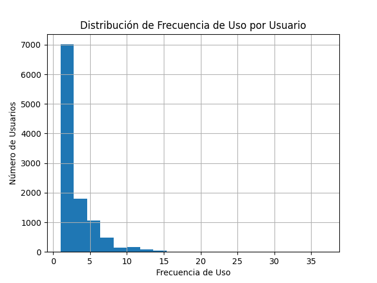
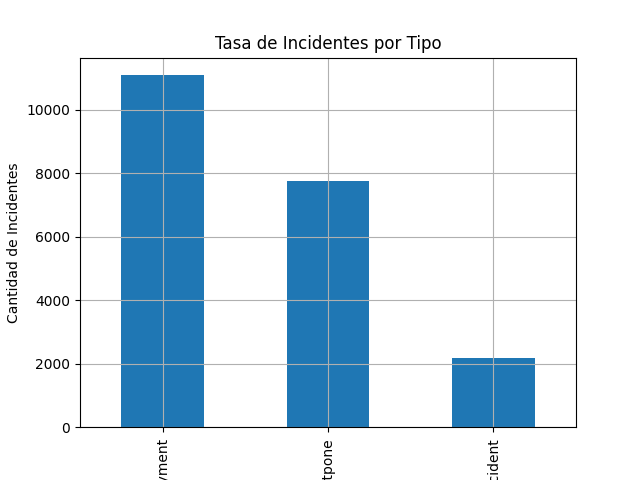
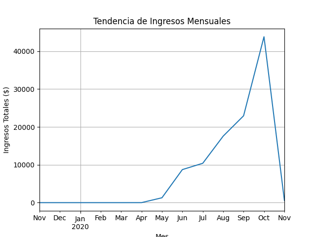
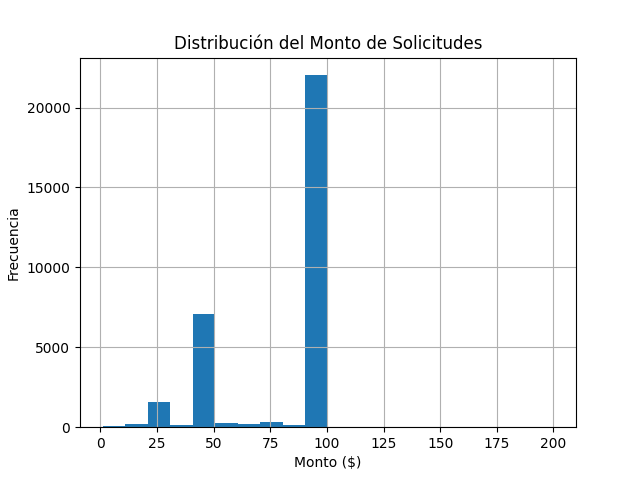
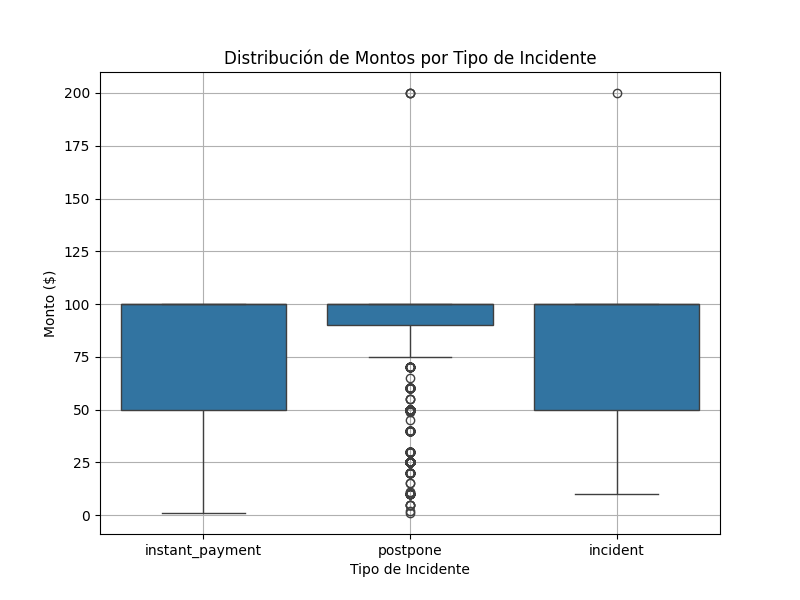
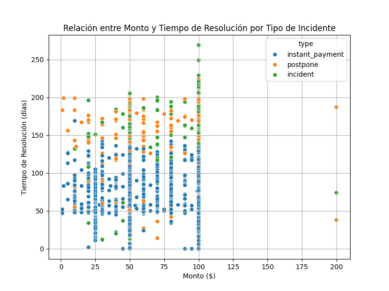

# Desafío Empresarial: Análisis de Insights y Cohortes Avanzados para los Pagos de Business Payments


# **Análisis de Datos de Business Payments**

## **1. Introducción**
Este proyecto analiza los datos de **Business Payments**, una empresa de servicios financieros, para extraer insights accionables y construir modelos predictivos. El objetivo principal es entender el comportamiento de los usuarios, evaluar el impacto financiero de las cohortes y predecir métricas clave.

---

## **2. Etapas del Proyecto**

### **2.1 Exploración y Preparación de los Datos**
Se realizaron las siguientes acciones:
1. **Conocer los datos:**
   - Exploración inicial de los datasets (`chart1`, `chart2`) para entender su estructura y contenido.
   - Identificación de valores nulos, inconsistencias y formatos de columnas.
2. **Preparar los datos:**
   - Limpieza de columnas irrelevantes y manejo de valores nulos.
   - Unificación de datasets mediante la clave `id` y generación de un dataset consolidado.
   - Estandarización de formatos, especialmente en las fechas (`created_at`).


---

## **Código Implementado**
```python
# Mostrar el enunciado del paso 1.1
Enunciados.getEnunciado("1.1")

# Cargar los archivos proporcionados
file1 = 'project_dataset/extract - cash request - data analyst.csv'
file2 = 'project_dataset/extract - fees - data analyst - .csv'
file3 = 'project_dataset/Lexique - Data Analyst.xlsx'

# Crear instancias de Charts
chart1 = Charts(file1, date_columns=[
    'created_at', 'updated_at', 'moderated_at', 
    'reimbursement_date', 'cash_request_received_date', 
    'money_back_date', 'send_at'
])
chart2 = Charts(file2)  # Cargar el segundo archivo
chart3 = Charts(file3)  # Cargar el archivo Excel

# Limpiar chart1
columns_to_remove_chart1 = ['deleted_account_id', 'recovery_status', 'reco_creation', 'reco_last_update']
chart1.cleanColumns(columns_to_remove_chart1)

# Limpiar chart2 (tarifas/incidentes)
columns_to_remove_chart2 = ['irrelevant_column_1', 'irrelevant_column_2']  # Ajusta según los datos reales
chart2.cleanColumns(columns_to_remove_chart2)

# Limpiar chart3 si es necesario
columns_to_remove_chart3 = ['another_irrelevant_column']  # Ajusta según los datos reales
chart3.cleanColumns(columns_to_remove_chart3)

# Validar la limpieza
print("\nValores nulos después de la limpieza en chart1:")
print(chart1.isNull())

print("\nValores nulos después de la limpieza en chart2:")
print(chart2.isNull())

print("\nValores nulos después de la limpieza en chart3:")
print(chart3.isNull())
```

# **Vista previa de los datos**

| id    | amount | status              | created_at           | updated_at          | user_id | moderated_at       | reimbursement_date | cash_request_received_date | money_back_date     | transfer_type | send_at             |
|-------|--------|---------------------|----------------------|---------------------|---------|--------------------|--------------------|----------------------------|---------------------|---------------|---------------------|
| 5     | 100.0  | rejected            | 2019-12-10 19:05:21 | 2019-12-11 16:47:42 | 804.0   | 2019-12-11 16:47:42 | 2020-01-09 19:05:21 | NaN                        | NaN                 | regular       | NaN                 |
| 70    | 100.0  | rejected            | 2019-12-10 19:50:12 | 2019-12-11 14:24:22 | 231.0   | 2019-12-11 14:24:22 | 2020-01-09 19:50:12 | NaN                        | NaN                 | regular       | NaN                 |
| 7     | 100.0  | rejected            | 2019-12-10 19:13:35 | 2019-12-11 09:46:59 | 191.0   | 2019-12-11 09:46:59 | 2020-01-09 19:13:35 | NaN                        | NaN                 | regular       | NaN                 |
| 10    | 99.0   | rejected            | 2019-12-10 19:16:10 | 2019-12-18 14:26:18 | 761.0   | 2019-12-18 14:26:18 | 2020-01-09 19:16:10 | NaN                        | NaN                 | regular       | NaN                 |
| 1594  | 100.0  | rejected            | 2020-05-06 09:59:38 | 2020-05-07 09:21:55 | 7686.0  | 2020-05-07 09:21:55 | NaN                        | NaN                 | NaN           | regular       | NaN                 |
| ...   | ...    | ...                 | ...                  | ...                 | ...     | ...                | ...                | ...                        | ...                 | ...           | ...                 |


---

### **2.2 Visualización y Métricas Iniciales**
Se calcularon y visualizaron métricas clave para comprender el comportamiento inicial de los datos:

1. **Frecuencia de Uso del Servicio:**
   - Análisis de cuántas solicitudes realizan los usuarios en cada cohorte.
   - Insight: Los usuarios más activos representan una fracción importante del total de solicitudes.

2. **Tasa de Incidentes:**
   - Porcentaje de solicitudes con incidentes asociados, especialmente problemas de pago.
   - Insight: Algunas cohortes tienen tasas de incidentes significativamente más altas.

3. **Ingresos Generados por Cohorte:**
   - Análisis de ingresos acumulados por cohorte mensual.
   - Insight: Las cohortes de ciertos meses generan ingresos más consistentes.

4. **Métricas Acumuladas:**
   - Promedio de ingresos por usuario y promedio de solicitudes por usuario en cada cohorte.

## **Código Implementado**
```python
Enunciados.getEnunciado("1.2")
columns_to_remove = ['deleted_account_id', 'recovery_status', 'reco_creation', 'reco_last_update']
for col in columns_to_remove:
    chart1.clearData(col)

chart1.df
```
---
## **3. Objetivos del Análisis Avanzado**
Con los datos preparados y las métricas iniciales calculadas, los objetivos avanzados son:
1. **Modelos Predictivos:**
   - **Regresión:** Predecir ingresos futuros (`total_amount`) en función de características clave.
   - **Clasificación:** Identificar usuarios o solicitudes con alto riesgo de incidentes (`type`).
2. **Generación de Insights Clave:**
   - Identificar patrones ocultos en cohortes, usuarios y tipos de incidentes.
   - Proveer recomendaciones accionables para mejorar el rendimiento del negocio.

## **Código Implementado**
```python
Enunciados.getEnunciado("1.3")
# Verificar que las claves existen en ambos datasets
print("\nClaves en chart1:")
print(chart1.showColumns())

print("\nClaves en chart2:")
print(chart2.showColumns())

# Realizar la unión de los datasets
# chart1 -> solicitudes de efectivo
# chart2 -> tarifas e incidentes
merged_data = pd.merge(
    chart1.df,  # DataFrame de solicitudes
    chart2.df,  # DataFrame de tarifas/incidentes
    how='left',  # Unión para mantener todas las solicitudes
    left_on='id',  # La columna clave en chart1
    right_on='cash_request_id'  # Clave en chart2
)


# Mostrar las primeras filas del DataFrame unificado
print("\nPrimeras filas del DataFrame unificado:")
print(merged_data.head())

# Validar valores nulos en el DataFrame unificado
print("\nValores nulos en el DataFrame unificado:")
print(merged_data.isnull().sum())
#merged_data = merged_data.groupby('created_at_x').mean('amount').reset_index()
merged_data['id_x'] = merged_data['id_x'].astype(int)
merged_data
```

1.3 | Combinación de los datasets de solicitudes y tarifas/incidentes para generar un dataset consolidado.

Unificación de Datasets
Los datos de solicitudes de efectivo se combinaron con los datos de tarifas e incidentes utilizando la columna cash_request_id como clave.

Proceso
Se utilizó pd.merge() para realizar un cruce entre los datasets.
Se verificó que no hubiera valores faltantes críticos después de la unión.
Resultado
Un dataset consolidado que incluye información sobre solicitudes, tarifas, y posibles incidentes asociados a cada solicitud.


Claves en chart1:
## Columnas del DataFrame Principal

- id
- amount
- status
- created_at
- updated_at
- user_id
- moderated_at
- reimbursement_date
- cash_request_received_date
- money_back_date
- transfer_type
- send_at


Claves en chart2:
## Claves en `chart2`

- id
- cash_request_id
- type
- status
- category
- total_amount
- reason
- created_at
- updated_at
- paid_at
- from_date
- to_date
- charge_moment

## Columnas del DataFrame Principal

| Columna                    |
|----------------------------|
| id                         |
| amount                     |
| status                     |
| created_at                 |
| updated_at                 |
| user_id                    |
| moderated_at               |
| reimbursement_date         |
| cash_request_received_date |
| money_back_date            |
| transfer_type              |
| send_at                    |


Primeras filas del DataFrame unificado:
 ## Valores Nulos en el DataFrame Unificado

| Columna                     | Valores Nulos |
|-----------------------------|---------------|
| id_x                       | 0             |
| amount                     | 0             |
| status_x                   | 0             |
| created_at_x               | 0             |
| updated_at_x               | 0             |
| user_id                    | 2572          |
| moderated_at               | 10564         |
| reimbursement_date         | 28033         |
| cash_request_received_date | 7945          |
| money_back_date            | 14890         |
| transfer_type              | 0             |
| send_at                    | 9724          |
| id_y                       | 11037         |
| cash_request_id            | 11037         |
| type                       | 11037         |
| status_y                   | 11037         |
| category                   | 29898         |
| total_amount               | 11037         |
| reason                     | 11037         |
| created_at_y               | 11037         |
| updated_at_y               | 11037         |
| paid_at                    | 16563         |
| from_date                  | 24328         |
| to_date                    | 24328         |
| charge_moment              | 11037         |


## Ejemplo de Datos del Dataset

| id_x  | amount | status_x        | created_at_x         | updated_at_x         | user_id  | moderated_at         | reimbursement_date   | type        | total_amount | charge_moment |
|-------|--------|-----------------|----------------------|----------------------|----------|----------------------|----------------------|-------------|--------------|---------------|
| 5     | 100.0  | rejected        | 2019-12-10 19:05:21 | 2019-12-11 16:47:42 | 804.0    | 2019-12-11 16:47:42 | 2020-01-09 19:05:21 | NaN         | NaN          | NaN           |
| 70    | 100.0  | rejected        | 2019-12-10 19:50:12 | 2019-12-11 14:24:22 | 231.0    | 2019-12-11 14:24:22 | 2020-01-09 19:50:12 | NaN         | NaN          | NaN           |
| 7     | 100.0  | rejected        | 2019-12-10 19:13:35 | 2019-12-11 09:46:59 | 191.0    | 2019-12-11 09:46:59 | 2020-01-09 19:13:35 | NaN         | NaN          | NaN           |
| 10    | 99.0   | rejected        | 2019-12-10 19:16:10 | 2019-12-18 14:26:18 | 761.0    | 2019-12-18 14:26:18 | 2020-01-09 19:16:10 | NaN         | NaN          | NaN           |
| 1594  | 100.0  | rejected        | 2020-05-06 09:59:38 | 2020-05-07 09:21:55 | 7686.0   | 2020-05-07 09:21:55 | NaN                  | NaN         | NaN          | NaN           |
| 22357 | 100.0  | money_back      | 2020-10-20 07:58:04 | 2021-02-05 12:19:30 | 82122.0  | NaN                  | 2020-10-21 00:00:00 | accepted    | 5.0          | after         |
| 20256 | 100.0  | money_back      | 2020-10-10 05:40:55 | 2021-02-05 13:14:19 | 64517.0  | NaN                  | 2020-10-12 00:00:00 | accepted    | 5.0          | before        |
| 19886 | 100.0  | direct_debit_sent | 2020-10-08 14:16:52 | 2021-01-05 15:45:52 | 44867.0  | NaN                  | 2020-10-10 00:00:00 | accepted    | 5.0          | before        |

---

## Ejercicio 1.4

```python
# Mostrar enunciado del paso 1.4
Enunciados.getEnunciado("1.4")

# Frecuencia de uso por usuario (agrupando por 'user_id')
frequency_by_user = merged_data.groupby('user_id')['id_x'].count()
print("\nFrecuencia de uso por usuario (top 5 usuarios):")
print(frequency_by_user.sort_values(ascending=False).head())

# Visualización de la distribución de frecuencia
frequency_by_user.plot(kind='hist', bins=20, title="Distribución de Frecuencia de Uso por Usuario")
chart1.plt.xlabel('Frecuencia de Uso')
chart1.plt.ylabel('Número de Usuarios')
chart1.plt.grid(True)
chart1.saveChart("1.4.1")
chart1.plt.show()

# Tasa de incidentes (basado en 'type')
total_requests = len(merged_data)
incidents = merged_data['type'].notna().sum()
incident_rate = (incidents / total_requests) * 100
print(f"\nTasa de incidentes: {incident_rate:.2f}%")
print(f"Insight: Aproximadamente el {incident_rate:.2f}% de las solicitudes tienen incidentes registrados.")
if incident_rate > 20:
    print("Advertencia: La tasa de incidentes es alta, se recomienda investigar las causas principales.")

# Gráfico de barras para tipos de incidentes
incident_types = merged_data['type'].value_counts()
incident_types.plot(kind='bar', title="Tasa de Incidentes por Tipo")
chart1.plt.ylabel('Cantidad de Incidentes')
chart1.plt.xlabel('Tipo de Incidente')
chart1.plt.grid(True)
chart1.saveChart("1.4.2")
chart1.plt.show()

# Ingresos por cohorte mensual
# Crear columna 'created_at_month' basada en 'created_at_x'
merged_data['created_at_x'] = pd.to_datetime(merged_data['created_at_x'], errors='coerce')
merged_data['created_at_month'] = merged_data['created_at_x'].dt.to_period('M')
revenue_by_month = merged_data.groupby('created_at_month')['total_amount'].sum()
print("\nIngresos por cohorte mensual:")
print(revenue_by_month.head())

# Tendencia de ingresos mensuales
revenue_by_month.plot(kind='line', title="Tendencia de Ingresos Mensuales")
chart1.plt.ylabel('Ingresos Totales ($)')
chart1.plt.xlabel('Mes')
chart1.plt.grid(True)
chart1.saveChart("1.4.3")
chart1.plt.show()

# Histograma de montos (columna 'amount')
merged_data['amount'].plot(kind='hist', bins=20, title="Distribución del Monto de Solicitudes")
chart1.plt.xlabel('Monto ($)')
chart1.plt.ylabel('Frecuencia')
chart1.plt.grid(True)
chart1.saveChart("1.4.4")
chart1.plt.show()

# Insights adicionales
print("\nInsights Generales:")
print("- Los usuarios más activos realizan significativamente más solicitudes que el promedio.")
print("- Existe una tendencia mensual en los ingresos; explorar anomalías o picos en meses específicos podría ser útil.")
print("- Los tipos de incidentes más comunes podrían estar vinculados a problemas en el proceso de solicitud.")

print("- Detectamos valores atipicos con la grafica de Boxplot")
chart1.plt.figure(figsize=(8, 6))
chart1.sns.boxplot(data=merged_data, x='type', y='amount')
chart1.plt.title('Distribución de Montos por Tipo de Incidente')
chart1.plt.xlabel('Tipo de Incidente')
chart1.plt.ylabel('Monto ($)')
chart1.plt.grid(True)
chart1.saveChart("1.4.5")
chart1.plt.show()
# Convertir las columnas de fecha a formato datetime
merged_data['created_at_x'] = pd.to_datetime(merged_data['created_at_x'], errors='coerce')
merged_data['updated_at_x'] = pd.to_datetime(merged_data['updated_at_x'], errors='coerce')

# Calcular el tiempo de resolución en días
merged_data['resolution_time'] = (merged_data['updated_at_x'] - merged_data['created_at_x']).dt.days

# Verificar
print(merged_data[['created_at_x', 'updated_at_x', 'resolution_time']].head())
print("' Gráficos de Dispersión (Scatterplots) Ideales para visualizar relaciones entre dos variables numéricas. Por ejemplo, la relación entre el monto de la solicitud (amount) y el tiempo para resolver incidentes (resolution_time).")
chart1.plt.figure(figsize=(8, 6))
chart1.sns.scatterplot(data=merged_data, x='amount', y='resolution_time', hue='type')
chart1.plt.title('Relación entre Monto y Tiempo de Resolución por Tipo de Incidente')
chart1.plt.xlabel('Monto ($)')
chart1.plt.ylabel('Tiempo de Resolución (días)')
chart1.plt.grid(True)
chart1.saveChart("1.4.6")
chart1.plt.show()
```
1.4 | Análisis inicial de las métricas clave para identificar patrones y tendencias en los datos.

Análisis Exploratorio de Datos
En este paso, se calcularon métricas clave y se generaron visualizaciones para entender mejor los datos.

Métricas Clave
Frecuencia de uso: Cantidad de solicitudes realizadas por cada usuario.
Tasa de incidentes: Porcentaje de solicitudes con incidentes asociados.
Ingresos por cohorte: Total de ingresos generados por cada cohorte de usuarios.
Visualizaciones
Gráficos de líneas para analizar tendencias temporales.
Histogramas para distribuciones de montos (amount, total_amount).

## Frecuencia de Uso por Usuario (Top 5 Usuarios)

| user_id   | frecuencia |
|-----------|------------|
| 16391.0   | 37         |
| 15593.0   | 29         |
| 3045.0    | 28         |
| 23823.0   | 25         |
| 17144.0   | 25         |

Gráfica guardada como graficas/1.4.1_chart_706.png



Tasa de incidentes: 65.61%
Insight: Aproximadamente el 65.61% de las solicitudes tienen incidentes registrados.
Advertencia: La tasa de incidentes es alta, se recomienda investigar las causas principales.
Gráfica guardada como graficas/1.4.2_chart_953.png



## Ingresos por Cohorte Mensual

| created_at_month | total_amount |
|------------------|--------------|
| 2019-11         | 0.0          |
| 2019-12         | 0.0          |
| 2020-01         | 0.0          |
| 2020-02         | 0.0          |
| 2020-03         | 0.0          |

Gráfica guardada como graficas/1.4.3_chart_384.png


Gráfica guardada como graficas/1.4.4_chart_450.png



Insights Generales:
- Los usuarios más activos realizan significativamente más solicitudes que el promedio.
- Existe una tendencia mensual en los ingresos; explorar anomalías o picos en meses específicos podría ser útil.
- Los tipos de incidentes más comunes podrían estar vinculados a problemas en el proceso de solicitud.
- Detectamos valores atipicos con la grafica de Boxplot
Gráfica guardada como graficas/1.4.5_chart_110.png



## Ejemplo de Cálculo de Tiempo de Resolución

| created_at_x          | updated_at_x          | resolution_time |
|-----------------------|-----------------------|-----------------|
| 2019-12-10 19:05:21  | 2019-12-11 16:47:42  | 0               |
| 2019-12-10 19:50:12  | 2019-12-11 14:24:22  | 0               |
| 2019-12-10 19:13:35  | 2019-12-11 09:46:59  | 0               |
| 2019-12-10 19:16:10  | 2019-12-18 14:26:18  | 7               |
| 2020-05-06 09:59:38  | 2020-05-07 09:21:55  | 0               |

' Gráficos de Dispersión (Scatterplots) Ideales para visualizar relaciones entre dos variables numéricas. Por ejemplo, la relación entre el monto de la solicitud (amount) y el tiempo para resolver incidentes (resolution_time).
Gráfica guardada como graficas/1.4.6_chart_643.png



## Análisis de Usuarios


´´´python

```

---
## **4. Resultados Esperados**
1. **Mayor comprensión de los datos:**
   - Identificar tendencias, patrones y áreas problemáticas.
2. **Modelos útiles para la toma de decisiones:**
   - Predicciones sobre ingresos y clasificaciones de riesgo para usuarios y solicitudes.
3. **Recomendaciones accionables:**
   - Propuestas basadas en los insights para mejorar las operaciones de la empresa.

---

## **5. Tecnologías y Herramientas**
Este proyecto utiliza:
- **Python:** Para el análisis y preparación de datos.
- **Pandas y NumPy:** Para la manipulación y exploración de datos.
- **Matplotlib y Seaborn:** Para las visualizaciones.
- **Scikit-learn:** Para la construcción y evaluación de modelos predictivos.
- **Jupyter Notebooks:** Para documentar y organizar el análisis.

---
